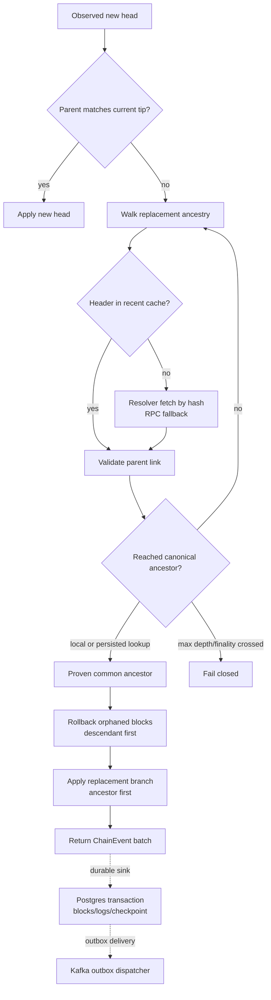

# chainweave

A reorg-safe EVM chain indexer in Rust. The project is being delivered incrementally from the [FDD](docs/reorg-safe-indexer-FDD.md); the current baseline establishes validated configuration, Alloy HTTP/WS connectivity, chain identity checks, and observability primitives.

## Quickstart

Install the Rust toolchain, then run a local EVM node. Anvil is distributed with Foundry:

```bash
curl -L https://foundry.paradigm.xyz | bash
foundryup
anvil
```

In another shell, read the current head:

```bash
cargo run -p chainweave-cli -- --rpc-url http://127.0.0.1:8545 head
```

The command prints the chain ID, latest block number/hash, and genesis hash as JSON. Pin the expected identity through CLI flags when connecting to a durable environment:

```bash
cargo run -p chainweave-cli -- \
  --rpc-url http://127.0.0.1:8545 \
  --expected-chain-id 31337 \
  --expected-genesis-hash 0xYOUR_32_BYTE_GENESIS_HASH \
  head
```

Configuration precedence is defaults, optional TOML, `CHAINWEAVE_*` environment variables, then CLI flags. Nested environment keys use a double underscore, for example `CHAINWEAVE_RPC__PRIMARY_URL`. Database credentials should be supplied with `CHAINWEAVE_DATABASE_URL`; secrets do not belong in committed TOML files.

## Tests

The default suite uses a deterministic in-process JSON-RPC fixture and does not depend on a public RPC:

```bash
cargo test --workspace --all-targets
```

The real-testnet smoke test is opt-in:

```bash
CHAINWEAVE_TESTNET_RPC_URL=https://YOUR_TESTNET_RPC \
  cargo test -p chainweave-cli --test testnet_smoke -- --ignored --nocapture
```

The `chainweave-sink` crate provides fail-closed `/health` and `/ready` state plus a Prometheus `/metrics` handler. A long-running worker process will bind these in a later increment; the current baseline only establishes and tests the server primitive.

## Reorg flow

The current transition module is pure in-memory chain coordination. It proves ancestry, emits ordered canonicality transitions, and leaves durable writes/outbox delivery for later increments.


