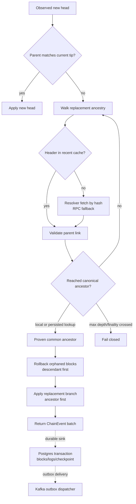

# chainweave

A reorg-safe EVM chain indexer in Rust. The project is being delivered incrementally from the [FDD](docs/reorg-safe-indexer-FDD.md); the current baseline establishes validated configuration, Alloy HTTP/WS connectivity, chain identity checks, observability primitives, and transactional Postgres state for canonical blocks/logs/checkpoints/outbox rows.

## Quickstart

Install the Rust toolchain, then run a local EVM node. Anvil is distributed with Foundry:

```bash
curl -L https://foundry.paradigm.xyz | bash
foundryup
anvil
```

In another shell, read the current head:

```bash
cargo run -p chainweave-cli -- --rpc-url http://127.0.0.1:8545 head
```

The command prints the chain ID, latest block number/hash, and genesis hash as JSON. Pin the expected identity through CLI flags when connecting to a durable environment:

```bash
cargo run -p chainweave-cli -- \
  --rpc-url http://127.0.0.1:8545 \
  --expected-chain-id 31337 \
  --expected-genesis-hash 0xYOUR_32_BYTE_GENESIS_HASH \
  head
```

Configuration precedence is defaults, optional TOML, `CHAINWEAVE_*` environment variables, then CLI flags. Nested environment keys use a double underscore, for example `CHAINWEAVE_RPC__PRIMARY_URL`. Database credentials should be supplied with `CHAINWEAVE_DATABASE_URL`; secrets do not belong in committed TOML files.

## Tests

The default suite uses deterministic in-process fixtures and does not depend on a public RPC or local Postgres:

```bash
cargo test --workspace --all-targets
```

When `CHAINWEAVE_TEST_DATABASE_URL` is unset, the Postgres integration tests print an explicit local skip. They do not silently pass in CI: setting `CI=true` or `CHAINWEAVE_REQUIRE_POSTGRES_TESTS=1` makes a missing database URL a test failure.

Use the Postgres proof command for the M2 acceptance suite:

```bash
make test-postgres-state
```

That target starts a real Postgres instance, runs `cargo test --workspace --all-targets` with Postgres tests required, applies the checked-in migrations, and verifies SQLx offline metadata with:

```bash
cargo sqlx prepare --workspace --check
```

Install the SQLx CLI first if needed:

```bash
cargo install sqlx-cli --version 0.8.6 --no-default-features --features rustls,postgres --locked
```

By default the target uses Docker with `postgres:16-alpine` when Docker is accessible; otherwise it falls back to an ephemeral local `initdb`/`pg_ctl` data directory under `target/`. Force one provider with `POSTGRES_STATE_PROVIDER=docker` or `POSTGRES_STATE_PROVIDER=local`.

If port `55432` is already in use, choose another host port:

```bash
POSTGRES_STATE_PORT=55433 make test-postgres-state
```

The real-testnet smoke test is opt-in:

```bash
CHAINWEAVE_TESTNET_RPC_URL=https://YOUR_TESTNET_RPC \
  cargo test -p chainweave-cli --test testnet_smoke -- --ignored --nocapture
```

The `chainweave-sink` crate provides fail-closed `/health` and `/ready` state plus a Prometheus `/metrics` handler. A long-running worker process will bind these in a later increment; the current baseline establishes and tests the server primitive and the durable Postgres writer.

## Reorg flow

The current transition module proves ancestry and emits ordered canonicality transitions. The Postgres writer now persists those transitions atomically into canonical block state, raw logs, checkpoint, and durable outbox rows; Kafka delivery remains a later increment.


```mermaid
flowchart TD
    A[Observed new head] --> B{Parent matches current tip?}
    B -->|yes| C[Apply new head]
    B -->|no| D[Walk replacement ancestry]
    D --> E{Header in recent cache?}
    E -->|yes| F[Validate parent link]
    E -->|no| G[Resolver fetch by hash<br/>RPC fallback]
    G --> F
    F --> H{Reached canonical ancestor?}
    H -->|local or persisted lookup| I[Proven common ancestor]
    H -->|no| D
    H -->|max depth/finality crossed| J[Fail closed]
    I --> K[Rollback orphaned blocks<br/>descendant first]
    K --> L[Apply replacement branch<br/>ancestor first]
    L --> M[Return ChainEvent batch]
    M -. durable sink .-> N[Postgres transaction<br/>blocks/logs/checkpoint]
    N -. outbox delivery .-> O[Kafka outbox dispatcher]
```
